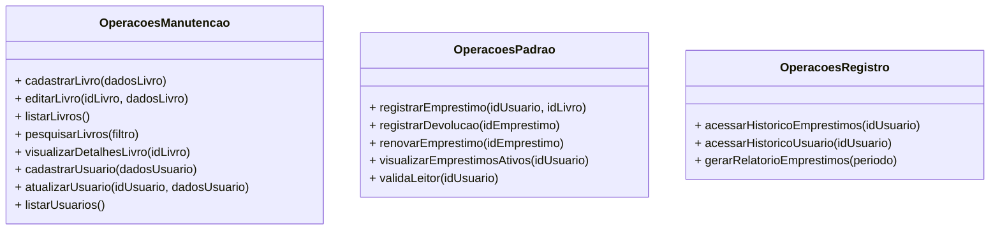
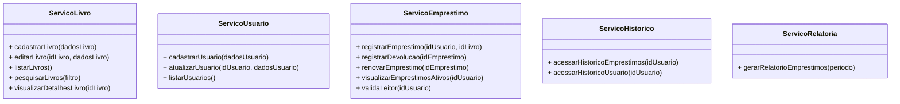

# Detalhe dos Fluxos do Sistema

### UC01 - Empréstimo de material

#### Atores:
1. Bibliotecário

#### Fluxo principal: 
1. Bibliotecário informa o ID do exemplar;
2. Bibliotecário informa o ID do leitor;
3. Sistema valida se leitor está apto para emprestar material;
4. Sistema associa material emprestado ao leitor e define data de devolução;
5. Sistema confirma o empréstimo e retira uma unidade dos exemplares disponíveis.

### UC02 - Cadastro de usuário

#### Atores:
1. Bibliotecário

#### Fluxo principal: 
1. Bibliotecário informa os dados pessoais do leitor (nome, cpf, email, telefone);
2. Sistema verifica se já existe leitor cadastrado com o cpf informado;
3. Bibliotecário solicita que leitor cadastre uma senha;
4. Sistema verifica se senha está no formato válido;
5. Bibliotecário confirma o cadastro;
6. Sistema registra os dados do leitor.

### UC03 - Cadastro de material

#### Atores:
1. Bibliotecário

#### Fluxo principal:
1. Bibliotecário informa o ISBN do material;
2. Sistema valida se é ISBN válido;
3. Sistema registra informações referentes ao ISBN (classificação, tipo, idioma, ano de publicação, autores, editora);
4. Bibliotecário confirma o cadastro;
5. Sistema registra o cadastro e adiciona uma unidade do material no acervo.

### UC04 - Devolução de material

#### Atores:
1. Bibliotecário

#### Fluxo principal: 
1. Bibliotecário informa o ID do exemplar devolvido
2. Sistema verifica se devolução está dentro do prazo estabelecido no ato do empréstimo
3. Sistema registra devolução e acrescenta uma unidade dos exemplares disponíveis

### UC05 - Renovação de material

#### Atores:
1. Leitor

#### Fluxo principal: 
1. Leitor seleciona o material que gostaria de renovar
2. Sistema verifica se renovação está dentro do prazo estabelecido no ato do empréstimo
3. Sistema confirma a renovação e define nova data de devolução

--- 

# Interfaces do Sistema

# Operações em Interfaces Coesas

