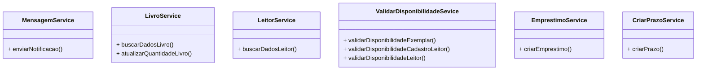

```mermaid
classDiagram
    class MensagemService {
        + enviarNotificacao()
    }

    class LivroService {
        + buscarDadosLivro()
        + atualizarQuantidadeLivro()
    }

    class LeitorService {
        + buscarDadosLeitor()
    }

    class ValidarDisponibilidadeSevice {
        + validarDisponibilidadeExemplar()
        + validarDisponibilidadeCadastroLeitor()
        + validarDisponibilidadeLeitor()
    }

    class EmprestimoService {
        + criarEmprestimo()
    }
    
    class CriarPrazoService {
        + criarPrazo()
    }

```
